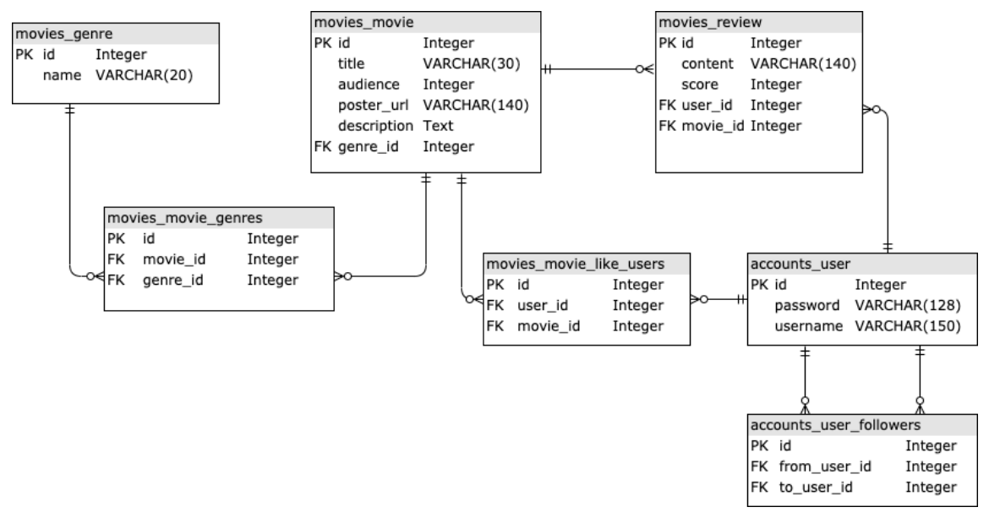
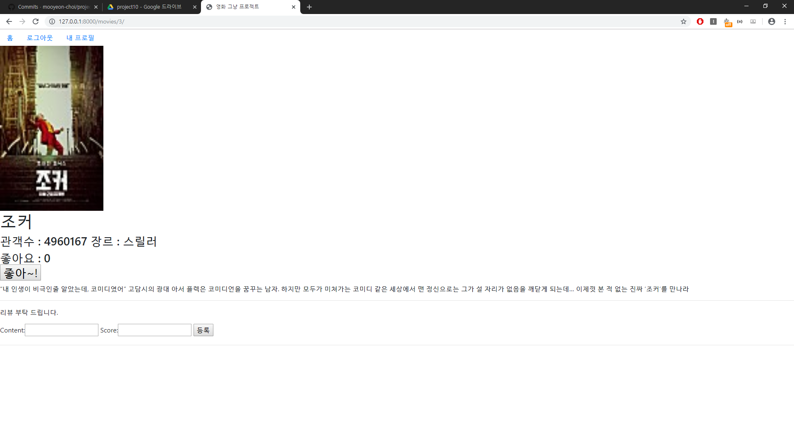
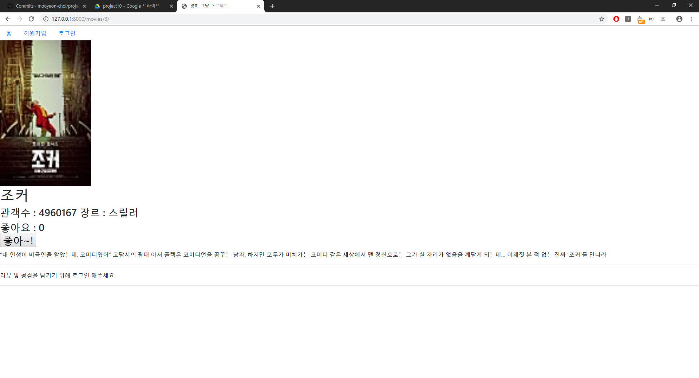
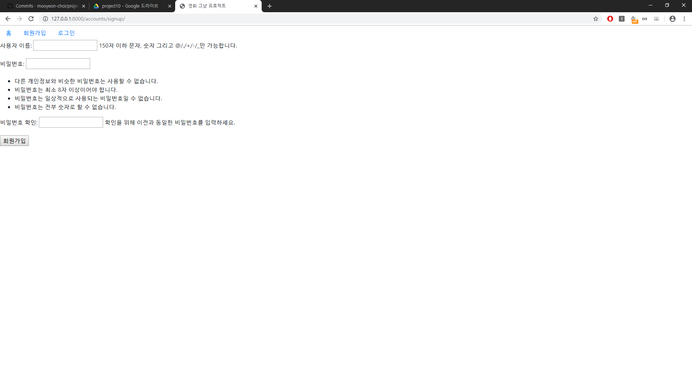
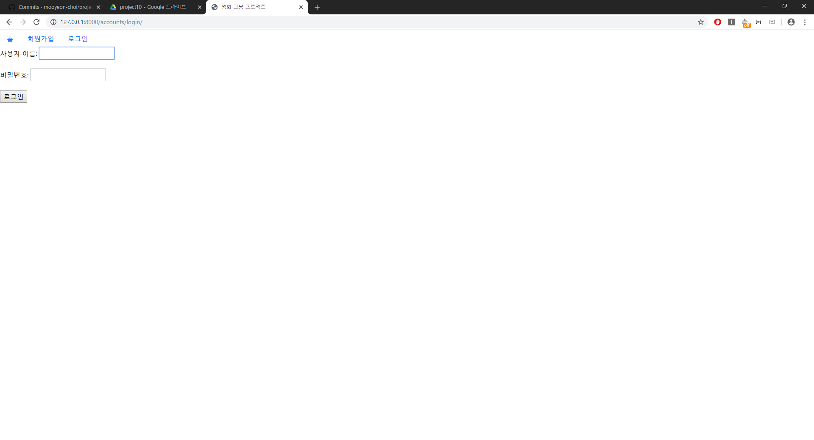
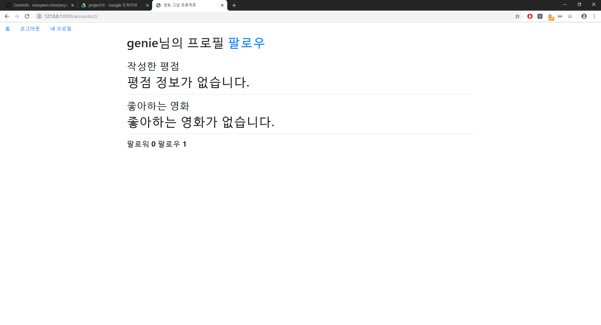

# 10 - Django (Pair Programming)

## 1. 목표

* 협업을 통한 데이터베이스 모델링 및 기능 구현

## 2. 준비 사항

1. (필수) Python Web Framework
   * Django 2.2.x
   * Python 3.7.x
2. (선택) 샘플 영화 정보
3. (선택) Github Flow

## 3. 요구사항

1. **데이터베이스 설계**

   * `db.sqlite3`에서 테이블 간의 관계는 아래와 같습니다.

   * ERD

     

2. **Seed Data 구성**

   * 임의의 데이터를 직접 추가 해보고 fixture 파일을 생성합니다.

3. **`accounts` App**

* 유저 회원가입과 로그인, 로그아웃 기능을 구현해야 합니다.
  1. 유저 목록 (` /accounts/` )
     1. **(필수)** 사용자의 목록이 나타나며, 사용자의 username 을 클릭하면 유저 상세보기 페이지로 넘어
        갑니다.
  2. 유저 상세보기 (`/accounts/{user_pk}/`)
     1. **(필수)** 해당 유저가 작성한 평점 정보가 모두 출력됩니다.
     2. **(필수)** 해당 유저가 좋아하는 영화 정보가 모두 출력됩니다.
     3. **(필수)** 해당 유저를 팔로우 한 사람의 수, 팔로잉 한 사람의 수가 출력됩니다.
  3. 영화 추천
     1. (선택) 영화 목록 상단에 자유로운 방식으로 영화를 1개 이상 추천 해주세요.
        * 예) 팔로우 유저의 높은 영화, 전체 유저의 높은 영화, 임의의 알고리즘 적용 등

1. **movies App**

* Genre와 영화는 생성/수정/삭제를 만들지 않습니다. 단, 관리자를 위하여 관리자 계정과 함께 관리자 페이지를 생성합니다.
  1. 영화 목록(`/movies/`)
     1. **(필수)** 영화의 이미지를 클릭하면 영화 상세보기 페이지로 넘어갑니다.
  2. 영화 상세보기(`/movies/{movie_pk}/`)
     1. **(필수)** 영화 관련 정보가 모두 나열됩니다.
     2. **(필수)** 로그인 한 사람만 영화 평점을 남길 수 있습니다.
     3. **(필수)** 모든 사람은 평점 목록을 볼 수 있습니다.
     4. **(필수)** 영화가 존재 하지 않는 경우 404 페이지를 보여줍니다.
  3. 평점 생성
     1. **(필수)** 영화 평점은 로그인 한 사람만 남길 수 있습니다.
     2. **(필수)** 평점 생성 URL은 `POST /movies/1/reviews/new/` , `POST
        /movies/2/reviews/new/` 등 이며, 동적으로 할당되는 부분이 존재합니다. 동적으로 할당되는
        부분에는 데이터베이스에 저장된 영화 정보의 Primary Key가 들어갑니다.
     3. **(필수)** 검증을 통해 유효한 경우 데이터베이스에 저장을 하며, 아닌 경우 영화 정보 조회 페이지 로Redirect 합니다.
     4. **(필수)** 데이터베이스에 저장되면, 해당하는 영화의 영화 상세보기 페이지로 Redirect 합니다.
     5. **(필수)** 영화가 존재 하지 않는 경우 404 페이지를 보여줍니다.
  4. 평점 삭제
     1. **(필수)** 영화 평점 삭제는 본인만 가능합니다.
     2. **(필수)** 평점 삭제 URL은 `POST /movies/1/reviews/1/delete/` , `POST
        /movies/1/reviews/2/delete/` 등 이며, 동적으로 할당되는 부분이 존재합니다. 동적으로 할
        당되는 부분에는 데이터베이스에 저장된 영화 정보의 Primary Key와 평점의 Primary Key가 들
        어갑니다.
     3. **(필수)** 데이터베이스에서 삭제되면, 해당하는 영화의 영화 상세보기 페이지로 Redirect 합니다.
     4. **(필수)** 영화가 존재 하지 않는 경우 404 페이지를 보여줍니다.
  5. 영화 좋아요 기능 구현
     1. **(필수)** 좋아하는 영화를 담아 놓을 수 있도록 구현합니다.
     2. **(필수)** 로그인 한 유저만 해당 기능을 사용할 수 있습니다.
     3. **(필수)** 영화 좋아요 URL은 `POST /movies/1/like/` 등 이며, 동적으로 할당되는 부분이 존재
        합니다. 동적으로 할당되는 부분에는 데이터베이스에 저장된 영화 정보의 Primary Key가 들어갑니
        다.
     4. **(필수)** 적합한 위치에 좋아요 링크를 생성합니다.
     5. **(필수)** 영화가 존재 하지 않는 경우 404 페이지를 보여줍니다.

## 4. 결과

1. `/movies/` 페이지

   

2. `/movies/{movie_pk}/` : Detail 페이지 (로그인 상태)

   

3. `/movies/{movie_pk}/` : Detail 페이지 (비로그인 상태)

   

4. `/accounts/signup/` : 회원가입 페이지

   

5. `/accounts/login/` : 로그인 페이지

   

6. `/accounts/{user_pk}/` : 프로필 페이지

   

## 5. 소감문

처음으로 git을 제대로 써보았다는 생각이 듭니다.

협업 프로젝트를 진행하면서 정말 많은 회의를 거쳤습니다.

최종 프로젝트를 진행할 때 도움이 많이 될거 같습니다.

감사합니다.